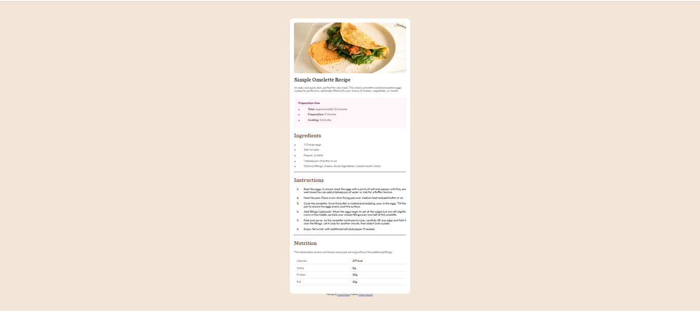

# Frontend Mentor - Recipe page solution

This is a solution to the [Recipe page challenge on Frontend Mentor](https://www.frontendmentor.io/challenges/recipe-page-KiTsR8QQKm). Frontend Mentor challenges help you improve your coding skills by building realistic projects.

## Table of contents

- [Overview](#overview)
  - [Screenshot](#screenshot)
  - [Links](#links)
- [My process](#my-process)
  - [Built with](#built-with)
  - [What I learned](#what-i-learned)
- [Author](#author)

## Overview

### Screenshot

### Links

- Solution URL: [Add solution URL here](https://github.com/donttouchtomi/Recipe-Page.git)
- Live Site URL: [Add live site URL here](https://effulgent-malasada-cdf8c5.netlify.app/)

## My process

### Built with

- Semantic HTML5 markup
- CSS custom properties
- Flexbox

### What I learned

I really learnt alot doing this project
I learnt using the table element in HTML and styling them, I also learnt how to use the ul or ol elements too and styling them

## Author

- Frontend Mentor - [@donttouchtomi](https://www.frontendmentor.io/profile/donttouchtomi)
- Twitter - [@donttouch_tomi](https://www.twitter.com/donttouch_tomi)
